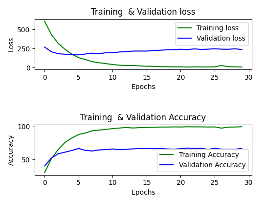
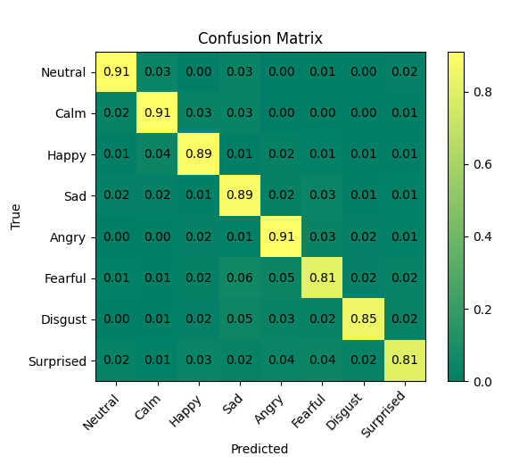

# Emotion Recognition on the RAVDESS Dataset

This project focuses on emotion recognition using the **RAVDESS dataset**, employing single modalities (audio and video) and multimodal fusion (audio-video) through the **joint fusion strategy**.

---

## Project Architecture

Below is the architecture used in this project:

  

---

## Dataset Information

The dataset used in this project is the **[RAVDESS dataset](https://zenodo.org/record/1188976)**.  
To set up the dataset:

1. **Create two folders**:
   - `audio_dataset`: This folder should contain all the audio files (speech and song).
   - `vid_dataset`: This folder should contain all the video files (speech and song).

---

## Steps to Run the Project

1. **Run the `joint_feature_extractor.py` file**:  
   This script performs the following tasks:
   - Processes audio data by applying **MFCC (Mel-frequency cepstral coefficients)** and organizes them.
   - Splits the video files into frames and creates horizontal collages.
   - Organizes all the data into the appropriate folder structure.

   ```bash
   python joint_feature_extractor.py

2. **Splits the processed data into training, testing, and validation sets**:
   ```bash
   python create_train_test_and_val_set.py

3. **Run the expand_audio_files.py file**:
   Duplicates audio signals to match the number of images in the video frames folders.
   ```bash
   python expand_audio_files.py

4. **Run the main.py file**:
    Select the modality (audio, video, or multimodal) you want to test.
    Run the following command to test your setup:
    ```bash
   python main.py

---
## Results of Audio Modality 



## Results of Visual Modality 


## Results of Audio-Visual Modality 



---
## Publications Related to This Project

If you use this project in your research, please consider citing the following papers:

1. **[Emotion Recognition from Audio-Visual Information based on Convolutional Neural Network](https://doi.org/10.1109/ICCAD57653.2023.10152451)**  
   *Authors*: Haddad Syrine, Olfa Daassi, Safya Belghith  
   *Published in*: 7th International Conference on Control, Automation, and Diagnosis (ICCAD’23) , 2023 
   ```bibtex
        @INPROCEEDINGS{10152451, 
        author={Haddad, Syrine and Daassi, Olfa and Belghith, Safya},
        booktitle={2023 International Conference on Control, Automation and Diagnosis (ICCAD)}, 
        title={Emotion Recognition from Audio-Visual Information based on Convolutional Neural Network}, 
        year={2023},
        volume={},
        number={},
        pages={1-5},
        doi={10.1109/ICCAD57653.2023.10152451}}
 
2. **[Single Modality and Joint Fusion for Emotion Recognition on RAVDESS Dataset](https://doi.org/10.1007/s42979-024-03020-y)**  
   *Authors*: Haddad Syrine, Olfa Daassi, Safya Belghith  
   *Published in*: SN Computer Science, IF : 3.78 (Q2) 
    ```bibtex
        @article{haddad2024single,
        title={Single Modality and Joint Fusion for Emotion Recognition on RAVDESS Dataset},
        author={Haddad, Syrine and Daassi, Olfa and Belghith, Safya},
        journal={SN Computer Science},
        volume={5},
        number={6},
        pages={669},
        year={2024},
        publisher={Springer}
        }
`
---
Include the BibTeX citation in your publications to properly credit the work. Thank you for supporting this research!
